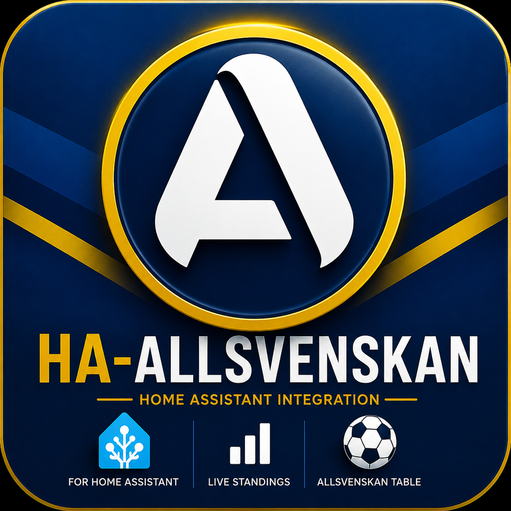

# Allsvenskan – Home Assistant Integration



 

Home Assistant integration that displays the current **Allsvenskan** standings table with team logos, points, goals and zone highlighting directly in your dashboard. Data is fetched from [Sofascore](https://www.sofascore.com/) — no API key required.


---

## Features

- 📋 Built-in **Lovelace card** with team logos and color-coded zones
- 📡 Sensor with the **full standings table** as attributes (`sensor.allsvenskan_tabell`)
- ⚽ One sensor **per team** with current position and detailed statistics
- 🔄 Automatically updated every **60 minutes**
- 🔑 No API key required

---

## Installation via HACS

1. Go to **HACS → Integrations → ⋮ → Custom repositories**
2. Add `https://github.com/ostbergjohan/ha-allsvenskan` as **Integration**
3. Search for **Allsvenskan** and click **Download**
4. **Restart Home Assistant**
5. Go to **Settings → Devices & Services → Add Integration → Allsvenskan**
6. Click **Submit** — no configuration needed

After restart, **add the card resource once**:

7. Go to **Settings → Dashboards → ⋮ (top right) → Resources**
8. Click **Add Resource**
9. URL: `/allsvenskan/allsvenskan-card.js`
10. Type: **JavaScript Module**
11. Click **Create** — then hard-refresh your browser (Ctrl+Shift+R)

---

## Lovelace Card

Add the card to your dashboard via **Edit Dashboard → Add Card → Custom: Allsvenskan Tabell**, or manually:

```yaml
type: custom:allsvenskan-card
entity: sensor.allsvenskan_tabell  # optional, this is the default
max_rows: 6                         # optional, default shows all 16 teams
favorite_team: Hammarby IF          # optional, highlights the matching row in yellow
show_logos: false                   # optional, hide team logo images in the table
fav_logo: https://example.com/hammarby.png  # optional, custom logo for the favourite row
```

| Option | Default | Description |
|---|---|---|
| `entity` | `sensor.allsvenskan_tabell` | The standings sensor |
| `max_rows` | all | Limit number of rows shown |
| `favorite_team` | — | Partial team name match, highlighted in yellow |
| `show_logos` | `true` | Set to `false` to hide team logo images in the table while keeping the team text column visible |
| `fav_logo` | — | Image URL used as the logo for the favourite team row. Useful when Sofascore logos are blocked on your network. |
| `columns` | all | List of column keys to show: `position`, `team`, `played`, `won`, `draw`, `lost`, `goals`, `goal_difference`, `points` |

### Zone highlighting

| Color | Zone |
|---|---|
| 🔵 Blue | Champions League qualification (position 1) |
| 🟠 Orange | European qualification (positions 2–3) |
| 🟤 Brown | Relegation playoff (position 14) |
| 🔴 Red | Direct relegation (positions 15–16) |

---

## Team Card

A hero-style card for a single team. Add via **Edit Dashboard → Add Card → Custom: Allsvenskan Lag**, or manually:

```yaml
type: custom:allsvenskan-team-card
entity: sensor.allsvenskan_hammarby_if
rows: 4          # optional, 1–4, default 4
logo: https://example.com/hammarby.png  # optional, overrides the sensor crest
```

| Option | Default | Description |
|---|---|---|
| `entity` | — | A team sensor, e.g. `sensor.allsvenskan_hammarby_if` |
| `rows` | `4` | Detail level: 1 = logo + position, 2 = + points, 3 = + W/D/L, 4 = + goals & form |
| `logo` | — | Image URL that permanently overrides the crest shown in the hero area. Useful when Sofascore logos are blocked on your network. |

---

## Team logos

Logos are fetched **server-side** by Home Assistant and embedded as base64 data — they are not loaded directly by the browser, so no hotlinking issues arise. If Sofascore's image endpoint is unreachable from your Home Assistant network (e.g. a firewall challenge), the logo area is simply left blank. The integration retries automatically every 5 hours.

To always display a logo you control, use the `fav_logo` option (table card) or `logo` option (team card) and point them to any publicly accessible image URL. If you prefer a cleaner text-only table, set `show_logos: false` on the table card.

---

## Sensors

### `sensor.allsvenskan_tabell`

Represents the **full standings table**.

| | |
|---|---|
| **State** | Name of the current league leader |
| **Attributes** | `season`, `standings` |

`standings` is a list with one object per team:

```json
{
  "position": 1,
  "team": "Hammarby IF",
  "team_short": "HIF",
  "team_id": 3211,
  "team_logo": "data:image/png;base64,…",
  "played_games": 10,
  "won": 7,
  "draw": 2,
  "lost": 1,
  "goals_for": 22,
  "goals_against": 9,
  "goal_difference": 13,
  "points": 23
}
```

---

### `sensor.allsvenskan_<team_name>`

One sensor per team, e.g. `sensor.allsvenskan_hammarby_if`.

| | |
|---|---|
| **State** | Table position (integer) |
| **Unit** | `pos` |
| **Attributes** | `team`, `points`, `played`, `won`, `draw`, `lost`, `goals_for`, `goals_against`, `goal_difference`, `crest` |

---

## Data Source

Data is fetched from the [Sofascore API](https://www.sofascore.com/) (Allsvenskan, unique tournament id 40). No account or API key required. Updates every 60 minutes.

---

## License

MIT – see [LICENSE](LICENSE) for details.
